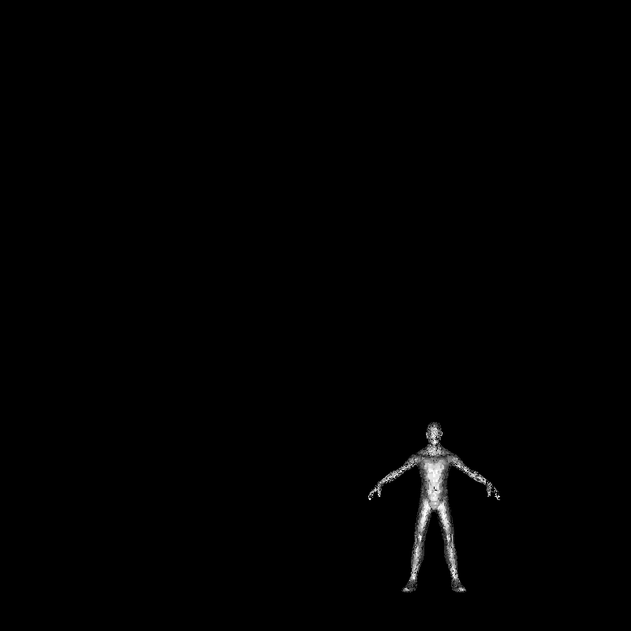

# SR4-Flat-shading
Para obtener la nota completa de ésta tarea deben entregar lo siguiente:

Código fuente capaz de cargar un archivo .obj al software renderer

Archivo obj de su elección 

Código fuente capaz de renderizar el zbuffer de su archivo obj

El modelo debe ser cargado en el centro de la pantalla y debe ser completamente visible. Recuerden incluir instrucciones sobre como renderizar su modelo y sobre cómo renderizar su zbuffer.

 
